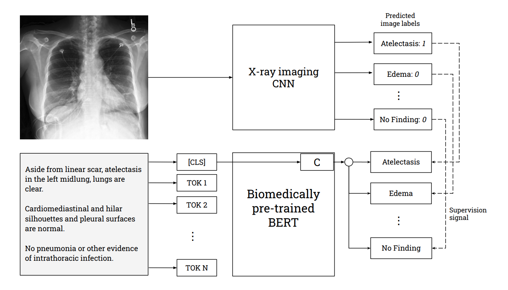

# VisualCheXbert: Addressing the Discrepancy Between Radiology Report Labels and Image Labels
VisualCheXbert is an automated deep-learning based chest radiology report labeler that can label for the following 14 medical observations: Fracture, Consolidation, Enlarged Cardiomediastinum, No Finding, Pleural Other, Cardiomegaly, Pneumothorax, Atelectasis, Support Devices, Edema, Pleural Effusion, Lung Lesion, and Lung Opacity. VisualCheXbert aims to produce better labels for computer vision models using only the textual reports and improves performance compared to previous report labeling approaches when evaluated against labels annotated by radiologists observing associated chest X-ray images.

Paper (Accepted to ACM-CHIL 2021): https://arxiv.org/pdf/2102.11467.pdf

## Abstract

Automatic extraction of medical conditions from free-text radiology reports is critical for supervising computer vision models to interpret medical images. In this work, we show that radiologists labeling reports significantly disagree with radiologists labeling corresponding chest X-ray images, which reduces the quality of report labels as proxies for image labels. We develop and evaluate methods to produce labels from radiology reports that have better agreement with radiologists labeling images. Our best performing method, called VisualCheXbert, uses a biomedically-pretrained BERT model to directly map from a radiology report to the image labels, with a supervisory signal determined by a computer vision model trained to detect medical conditions from chest X-ray images. We find that VisualCheXbert outperforms an approach using an existing radiology report labeler by an average F1 score of 0.14 (95% CI 0.12, 0.17). We also find that VisualCheXbert better agrees with radiologists labeling chest X-ray images than do radiologists labeling the corresponding radiology reports by an average F1 score across several medical conditions of between 0.12 (95% CI 0.09, 0.15) and 0.21 (95% CI 0.18, 0.24).



## Prerequisites 

Create conda environment

```
conda env create -f environment.yml
```

Activate environment

```
conda activate visualCheXbert
```

By default, all available GPU's will be used for labeling in parallel. If there is no GPU, the CPU is used. You can control which GPU's are used by appropriately setting CUDA_VISIBLE_DEVICES. The batch size by default is 18 but can be changed inside constants.py

## Checkpoint download

Download our trained model checkpoints here: https://drive.google.com/file/d/1Od62LAbdmfcK6W8TfzNcLIUouxWZoMHn/view?usp=sharing.

## Usage

### Label reports with VisualCheXbert

1. Put all reports in a csv file under the column name "Report Impression" (see src/sample_reports.csv for an example). The path to this csv is {path to reports}. 
2. Download and unzip the checkpoint folder in the src directory (see above section). The path to this folder is {path to checkpoint folder}.
3. Navigate to the src directory and run the following command, where the path to your desired output folder is {path to output dir}:

```
python label.py -d={path to reports} -o={path to output dir} -c={path to checkpoint folder} 
```

The output file with labeled reports is {path to output dir}/labeled_reports.csv

Run the following for descriptions of all command line arguments:

```
python label.py -h
```

**Ignore any error messages about the size of the report exceeding 512 tokens. All reports are automatically cut off at 512 tokens.**

# Citation

If you use the VisualCheXbert labeler in your work, please cite our paper:

```
@article{jain2021visualchexbert,
  title={VisualCheXbert: Addressing the Discrepancy Between Radiology Report Labels and Image Labels},
  author={Jain, Saahil and Smit, Akshay and Truong, Steven QH and Nguyen, Chanh DT and Huynh, Minh-Thanh and Jain, Mudit and Young, Victoria A and Ng, Andrew Y and Lungren, Matthew P and Rajpurkar, Pranav},
  journal={arXiv preprint arXiv:2102.11467},
  year={2021}
}
```
